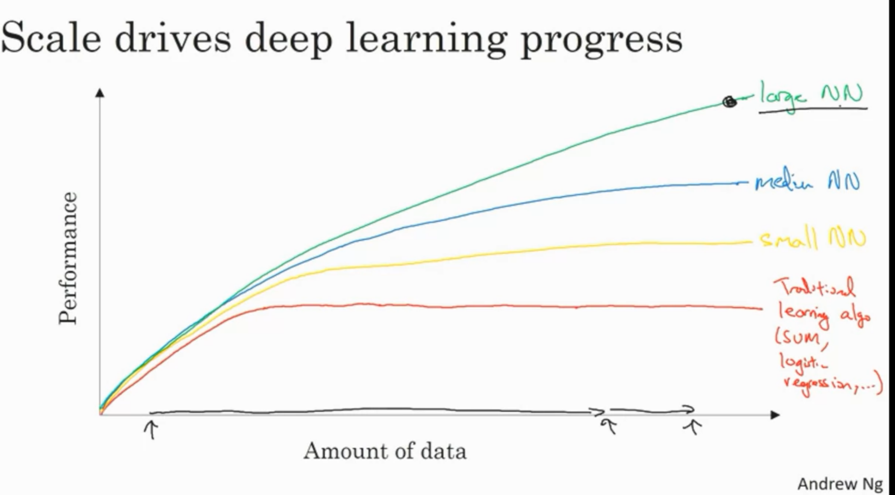

# Week 1

## Neural Networks

## Supervised Learning and Neural Networks

In this input and output is known

### Neural Network Examples

1. Standard NN
2. Convolutional NN (CNN)
3. Recurrent NN

**other terms**

`structured data` i.e. each of the feature has very well defined meaning. e.g. user data for ads

`un-structured data` i.e. feature doesn't have well defined meaning. e.g. audio, image, text

## Deep Learning

with smaller training data set, training algorithms are not well defined and accuracy depends upon the individual person ability to understand the data and NN.

