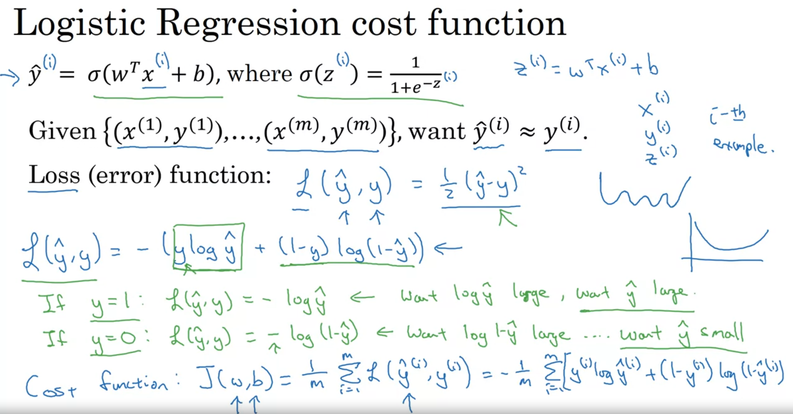

# Week 2

## Binary Classification

Output 0 or 1.

## Logistic Regression

Given `x` (feature vector), want `y` (output) to give a chance that it is belonging to 1. similarly for 0.

i.e. output is not exactt 1 or 0 (e.g. output with sigmoid or other)

## Logistic Regression Cost Function

cost function

## Gradient Descent

## Computation Graph

