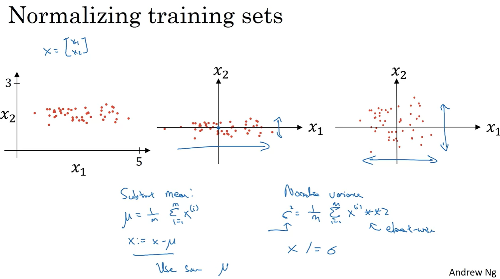

# Setting Up Normalizing Inputs

## Normalizing Inputs
When training a neural network, one of the techniques to speed up your training is if you normalize your inputs.

1. This means that you just move the training set until it has `zero mean`. 
2. Then the second step is to `normalize the variances`.

If you use this to scale your training data, then use the same mu and sigma to normalize your test set. In particular, you don't want to normalize the training set and a test set differently. Whatever this value is and whatever this value is, use them in these two formulas so that you scale your test set in exactly the same way

## Vanishing/Exploding Gradients
One of the problems of training neural network, especially very deep neural networks, is data vanishing and exploding gradients. What that means is that when you're training a very deep network your derivatives or your slopes can sometimes get either very, very big or very, very small, maybe even exponentially small, and this makes training difficult

`In fact, for a long time this problem was a huge barrier to training deep neural networks. It turns out there's a partial solution that doesn't completely solve this problem but it helps a lot which is careful choice of how you initialize the weights. `

## Weights Initialization for Deep Networks
It turns out that a partial solution to this, doesn't solve it entirely but helps a lot, is better or more careful choice of the random initialization for your neural network.

## Numerical Approximation of Gradients

## Gradient Checking
Gradient checking is a technique that's helped me save tons of time, and helped me find bugs in my implementations of back propagation many times. Let's see how you could use it too to debug, or to verify that your implementation and back process correct. 

## Gradient Checking Implementation Notes

1. First, don't use grad check in training, only to debug.
2.  if an algorithm fails grad check, look at the components, look at the individual components, and try to identify the bug
3. Remember Regularization
4.  grad check doesn't work with dropout, because in every iteration, dropout is randomly eliminating different subsets of the hidden units.
5.  but one thing you could do is run grad check at random initialization and then train the network for a while so that w and b have some time to wander away from 0, from your small random initial values. 

