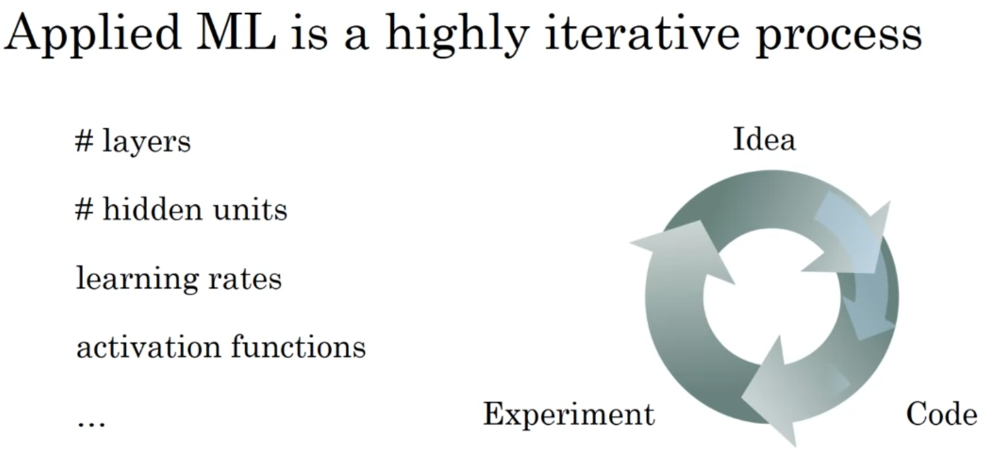
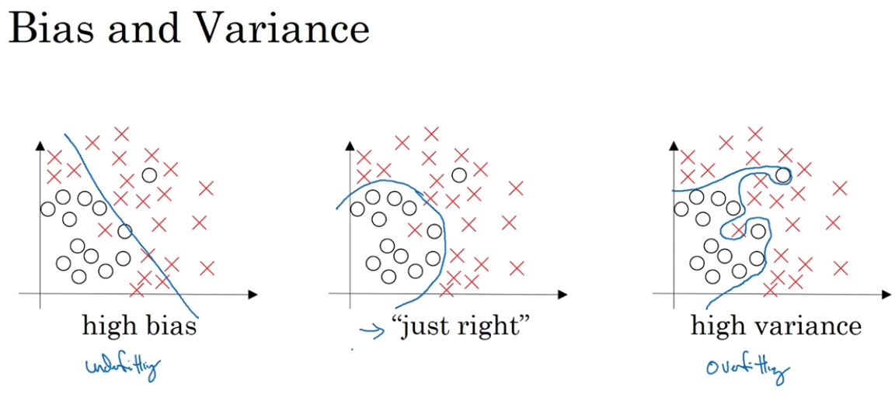

# week 1

Applied ML is a highly iterative process. 

`Train/dev/test` sets

for big data, we can have 99.5/0.4/0.1 or other. There is no specific guideline.

`mismatched` train/test distribution

e.g. trained from the images from internet and test images from real images.

**Thumb Rule** Make sure `dev and test` come from same distribution.

**Note:** It is also ok to not having a `test set` (only dev set).

## Bias/Variance

 almost all the really good machine learning practitioners tend to have a very sophisticated understanding of bias and variance.

 

 Train set error | dev set error | remarks
 ---|---|----
 1% | 11% | it looks like, overfit in trainset i.e `high variance`
 15%| 16%| It looks like an underfit i.e. `high bias` because it's not even training
 15%|30%| `high bias` and `high variance`, kind of a linear classifier in a case or mixed classes
 0.5%| 1%| `low bias` and `low variance`

(Note: above numbers are just estimate)

## Basic Recipe for Machine learning

if we have high bias (from training data) ==> we can go for `bigger network, train longer` (or different NN architecture) (all is maybe)
keep doing above till high bias issue is resolved i.e. till training data is properly classified.

once high bias is removed then check if we have high variance (dev set performance) then try to get `more data, regularization1` (or different NN architecture)

try do above till we get low bias and low variance.

`Bias Variance Tradeoff`

