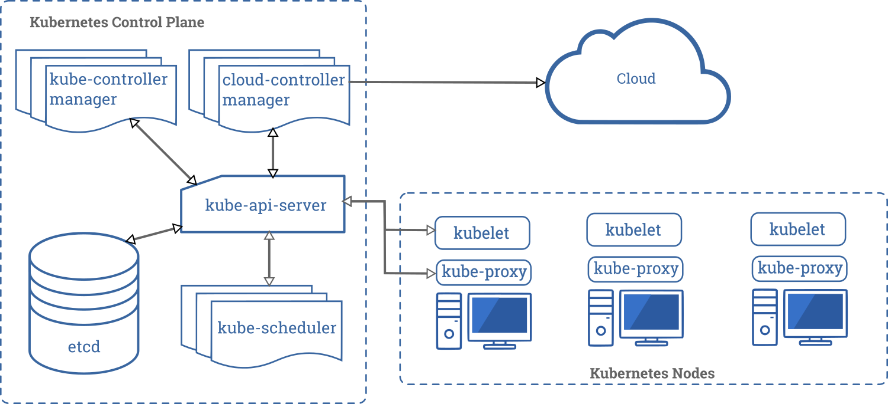
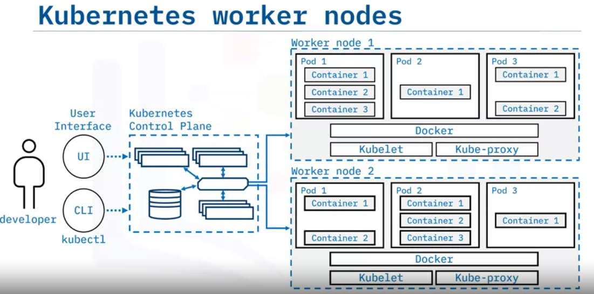
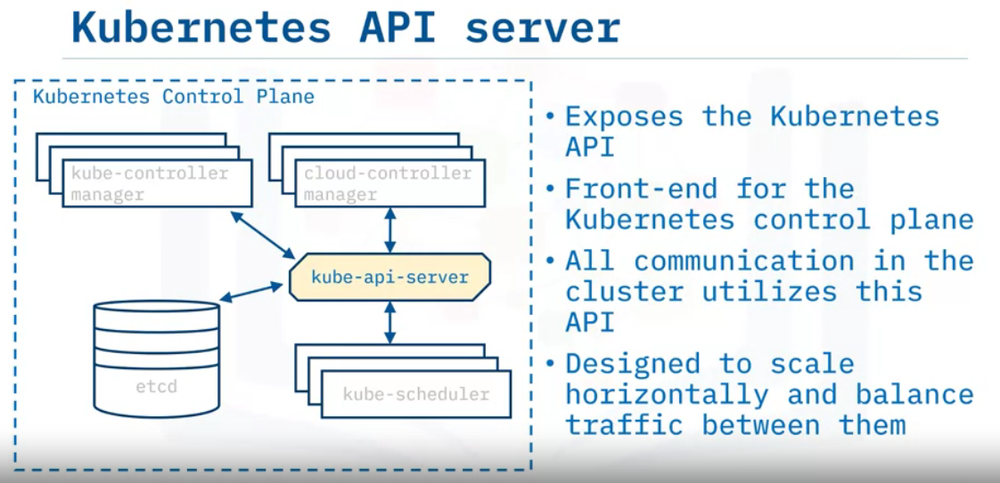
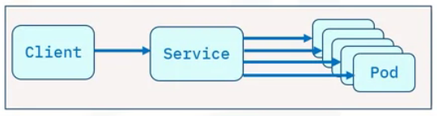
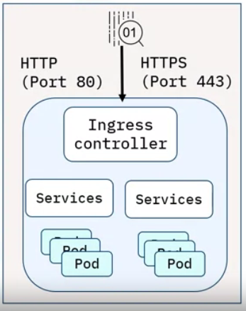
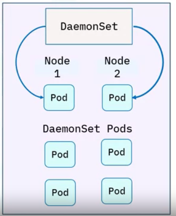
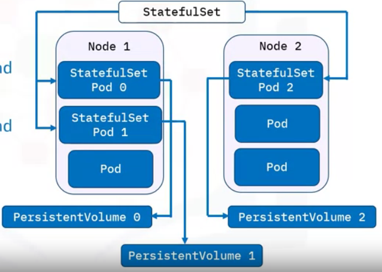
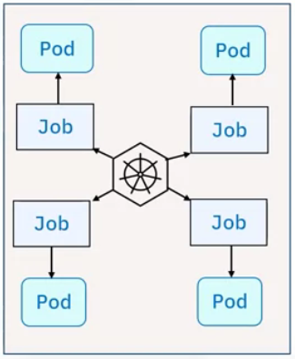

# Kubernetes
It is also known as `K8s`is an open source for automating deployment, scaling and management of containerized applications. It is an containerization orchestration platform. 

* It does not provide integration/continuous delivery (CI/CD) pipeline to deploy source code or build applications.

* Doesn't provide built-in middleware, databases or other services.

**Kubernetes Concepts**
object | concept
----|-----
Pods and workloads | `pods` are the smallest deployable compute objectto run workloads
Services | A serivce exposes application running on a set of pods.
Storage | it supports both persistent and temporary storage for pods.
Configuration | Resources that kubernetes provides for configuring pods
security | security for cloud-native workloads enforces security for pos and API access
policies| create policies for groups of resources
Schedule, Eviction| runs and proactively terminates one or more pods on resource-starved Nodes
Preemption | Terminates lower priority pods so that higher priority pods can run on Nodes
Administration | Management details necessary to administer a Kubernetes cluster

**Capabilities**

1. Automated rollouts and rollbacks
2. Storage Orchestration
3. Horizontal scaling
4. Automated bin packing
5. Scret and configuration management
6. IPv4/IPv6 dual-stack
7. Batch execution
8. Self-healing
9. Service discovery and load balancing
10. Designed for extensibility

## Kubernetes Architecture

**Kubernetes Control Plane**

**Worker Nodes**

**API Server**

 **etcd**

 * Highly available, distributed key-value store that contains all cluster data.
 * stores deployment configuration data, the desired state and meta data in a way that can be accessed in a common location.

 **Kubernetes Scheduler**

 * Assigns newly created pods to nodes.
 * selects optimal node according to Kubernetes scheduling principles, configuration options and available resources.

  **Kubernetes Controller Manager**

  * Runs controller processes that monitor cluster state.
  * runs controller processes that ensures the actual state matches the desired state.

  **Cloud controller manager**
  
  * Runs controllers that interact with underlying cloud providers.
  * Links clusters into a cloud provider's API

  **Nodes**

  * These are the worker machines in Kubernetes
  * May be a virtual or physical machine
  * Managed by the control plane.
  * They include `pods` which are the smallest deployment entity in Kubernetes.

**Kubelet**

* Communicates with the API server.
* Ensures that pods and their associated containers are running as desired.
* Reports to the control plane on the pods' health and status.

**Container Runtime**

* Downloads images and runs containers.
* Kubernetes implements an interface so that this component is pluggable.
* Docker is a well-known runtime.

**Kubernetes proxy**

* It is a network proxy.
* Maintains network rules that allow communication to pods.

## Kubernetes Objects
Kubernetes objects are persistent entities such as `pods, namespaces, Replicasets, Deployments etc`. These objects contains two main fields
1. Object Spec
  1. provided by user
  2. defines desired state
2. Status
  1. Provided by kubernetes
  2. Defines current state

To work with these objects, we can use Kubernetes API directly with the client libraries, or kubectl command-line interface or both.

**Labels and Selectors**

* Labels are `key/value` pairs attached to objects.
* Label selectors are the core grouping method in Kubernetes.

**Namespaces and names**

* Namespaces provide a mechanism for isolating groups of resources within a single cluster.
  * It provide a scope for object name. Each object has a name. Names are unique for a resource type within a namespace.

**Pods**

* It is a simplest unit and represents processes running in your cluster. 
* Encapsulates one or more containers.
* Replicating a pod serves to scale applications horizontally.
* `yaml` file simply defines a pod.

**ReplicaSet**

* It is a set of horizontally scaled running pods.
* A replicaset configuration file defines:
  * number of replicas
  * Pod template
  * selector to identify which pods it can acquire
* It is generally encapsulated by a Deployment.

**Deployment**

* It is a higher-level object that provides updates for Pods and ReplicaSets.
* Deployments:
  * Run multiple replicas of an application
  * Suitable for stateless applications.
  * Update triggers a rollout

**Service**

* It is REST object like Pods
* It provides policies for accessing the pods and cluster. It acts as load balancer across the pods.
* It is assigned a unique IP address for accessing applications deployed on Pods.
* It eliminates the need for a separate service discovery process.

**Service Properties**

* Supports multiple protocols such as TCP (default), UDP and others.
* Supports multiple port definitions.

Service is needed as `pods` in a cluster are volatile as they can be created and destroyed at any time. This volatility leads to discoverability issues because of changing IP addresses.

A service keeps track of the changes and exposes a single IP address or a DNS name. There are `four types` of services:

1. ClusterIP
2. NodePort
3. Load Balancer
4. External Name

**Service - ClusterIP**

* Is the default and most common service type.
* It cannot make requests to service (Pods) from outside the cluster.
* we set the Cluster IP address in the service definition file.
* It provides interservice communication within the cluster.

**Service - NodePort**

* It is an extension of `ClusterIP Service`
* Creates and routes the incoming requests automatically to the ClusterIP Service.

**Service - External Load Balancer (ELB)**

* An extension of the `NodePort service`, and ELB creates NodePort and ClusterIP Services Automatically.
* It Integrates and automatically directs traffic to the Nodeport service with a clud provider's ELB.

**Service - External Name**

* Maps to a DNS name and not to any selector. It requires a `spec.externalName` parameter.
* Maps the service to contents of the externalName field that returns a `CNAME` record and its value.

**Ingress**

* It is an API object (combined with a controller) that provides routing rules to manage external users' access to multiple services in a Kubernetes cluster.
* In production, Ingress exposes applications to the Internet via port 80 (HTTP) or port 443 (HTTPS)
* An ELB is expensive and is managed outside the cluster while the cluster monitors Ingress

**DaemonSet**

* It is an object that makes sure that Nodes run a copy of a Pod.
* As Nodes are added to a cluster, Pods are added to the Nodes.
* Pods are garbage collected when removed from a cluster.
* If we delete a daemonset, all pods are removed.
* Ideally used for storage, logs, and monitoring Nodes.

**StatefulSet**

* It manages the stateful applications.
* Manages deployment and scaling of Pods.
* Provides guarantees about the ordering and uniqueness of Pods.

**Job**

* It is an object that creates Pods and tracks its completion process.
* Jobs are retried until completed.
* Deleting a job will remove the created pods.
* Suspending a job will delete its active pods until the job resumes.
* A job can run several pods in parallel.
* A `cronjob` is regularly used to create Jobs on an iterative schedule.

