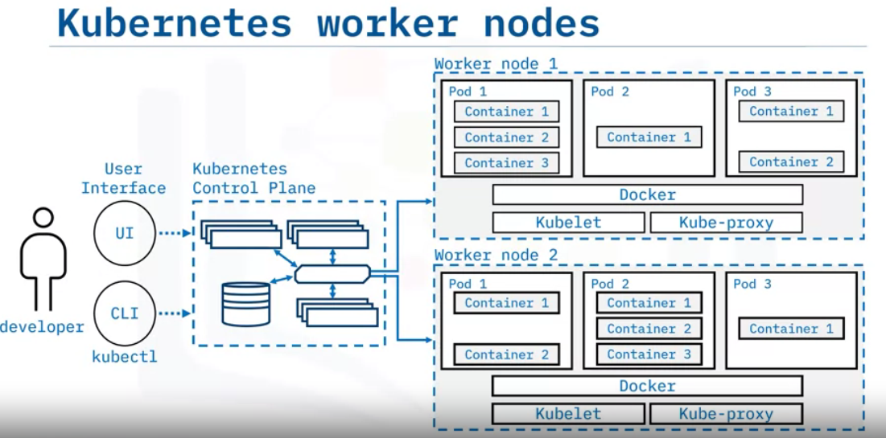
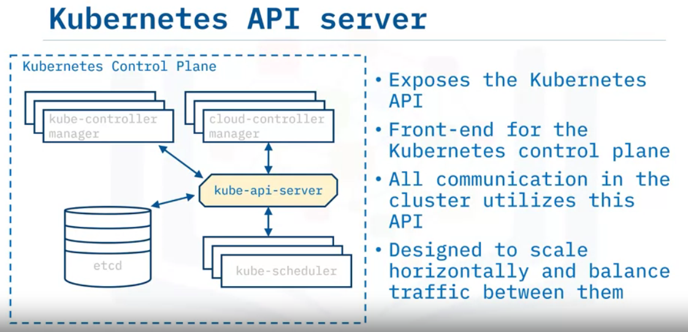

# Kubernetes
It is also known as `K8s`is an open source for automating deployment, scaling and management of containerized applications. It is an containerization orchestration platform. 

* It does not provide integration/continuous delivery (CI/CD) pipeline to deploy source code or build applications.

* Doesn't provide built-in middleware, databases or other services.

**Kubernetes Concepts**
object | concept
----|-----
Pods and workloads | `pods` are the smallest deployable compute objectto run workloads
Services | A serivce exposes application running on a set of pods.
Storage | it supports both persistent and temporary storage for pods.
Configuration | Resources that kubernetes provides for configuring pods
security | security for cloud-native workloads enforces security for pos and API access
policies| create policies for groups of resources
Schedule, Eviction| runs and proactively terminates one or more pods on resource-starved Nodes
Preemption | Terminates lower priority pods so that higher priority pods can run on Nodes
Administration | Management details necessary to administer a Kubernetes cluster

**Capabilities**

1. Automated rollouts and rollbacks
2. Storage Orchestration
3. Horizontal scaling
4. Automated bin packing
5. Scret and configuration management
6. IPv4/IPv6 dual-stack
7. Batch execution
8. Self-healing
9. Service discovery and load balancing
10. Designed for extensibility

## Kubernetes Architecture

**Kubernetes Control Plane**

**Worker Nodes**

**API Server**

 **etcd**

 * Highly available, distributed key-value store that contains all cluster data.
 * stores deployment configuration data, the desired state and meta data in a way that can be accessed in a common location.

 **Kubernetes Scheduler**

 * Assigns newly created pods to nodes.
 * selects optimal node according to Kubernetes scheduling principles, configuration options and available resources.

  **Kubernetes Controller Manager**

  * Runs controller processes that monitor cluster state.
  * runs controller processes that ensures the actual state matches the desired state.

  **Cloud controller manager**
  
  * Runs controllers that interact with underlying cloud providers.
  * Links clusters into a cloud provider's API

  **Nodes**

  * These are the worker machines in Kubernetes
  * May be a virtual or physical machine
  * Managed by the control plane.
  * They include `pods` which are the smallest deployment entity in Kubernetes.

**Kubelet**

* Communicates with the API server.
* Ensures that pods and their associated containers are running as desired.
* Reports to the control plane on the pods' health and status.

**Container Runtime**

* Downloads images and runs containers.
* Kubernetes implements an interface so that this component is pluggable.
* Docker is a well-known runtime.

**Kubernetes proxy**

* It is a network proxy.
* Maintains network rules that allow communication to pods.

## Kubernetes Objects
